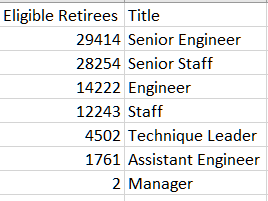
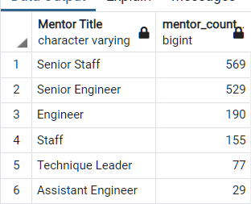
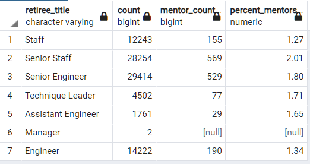
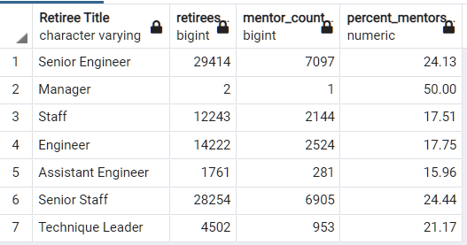

# Pewlett-Hackard Analysis: Planning for the Silver Tsunami

## Overview
Pewlett-Hackard employees 240,124 staff in nine departments and seven different job titles. The company realizes that the "baby-boomer" generation represents a large portion of their workforce, and that this population's retirement may have a significant impact on staffing in the next three to five years. The company has asked for an analysis of the employee database to help answer two questions:
1. How many roles will need to be filled as the "silver tsunami" begins to make an impact?
2. Are there enough quailifed, retirement-ready employees in the departments to mentor the next generation of Pewlett-Hackard employees?

## Results
Two major data components are necessary to perform the analysis. The first identifies all possible employees eligible for retirment within the next three years; the second looks for current employees who may be eligible for the mentorship program. Initial results include:
- 90,398 retirement eligible employees over the next three years
- Initial mentorship results provide only 1,549 mentors
- One of the retirement titles - managers - had no mentor selection in the initial mentorship query
- There is a very low percentage of mentors (<2%) to mentor the positions opened up by those who will retire in the next three years

### Deliverable One
The first database query used to determine the potential retirees looks for all current employees whose birthdays fall between January 1, 1952 and December 31, 1955. This initial file was exported as retirement_titles.csv; however, there is duplication in this file that must be addressed. The query is provided in the event there is a need for future refinement:

      ```
      SELECT e.emp_no, 
        e.first_name, 
        e.last_name, 
        t.title, 
        t.from_date, 
        t.to_date
      INTO retirement_titles
      FROM employees as e
      INNER JOIN	titles as t
      ON e.emp_no = t.emp_no
      WHERE (e.birth_date BETWEEN '1952-01-01' AND '1955-12-31')
      ORDER BY e.emp_no;
      ```

Next, duplication is removed to identify only those eligible retirees by their current title/ position. This list generates a unique list of eligibile employees, using the query below:

      ```
      SELECT DISTINCT ON (rt.emp_no)
        rt.emp_no, 
        rt.first_name, 
        rt.last_name, 
        rt.title
      INTO unique_titles
      FROM retirement_titles as rt
      ORDER BY rt.emp_no, rt.to_date DESC;
      ```
And finally, a summary is generated using the above data to identify the number of eligible retirees by job title. There are 90,398 employees eligible to retire in the next three years. The image presents the data by title, sorted by largest to smallest number of retirees.



### Deliverable Two
Next it is necessary to find those who are candidates for the mentorship program. These mentors will need to be sufficient in number to train future new employees hired to replace retirees. Initially, the prospective mentorship list was filtered to include all employees by title whose birthdays fall between January 1 - December 31, 1965. The following query is provided in the event of future refinement:

      ```
      SELECT DISTINCT ON (e.emp_no) e.emp_no, 
            e.first_name, 
            e.last_name, 
            e.birth_date,
            de.from_date,
            de.to_date,
            t.title
      INTO mentorship_eligibility
      FROM employees as e
      INNER JOIN dept_emp as de
      ON e.emp_no = de.emp_no
      INNER JOIN titles as t
      ON e.emp_no = t.emp_no
      WHERE (e.birth_date BETWEEN '1965-01-01' AND '1965-12-31')
      AND t.to_date ='9999-01-01'
      ORDER BY e.emp_no, t.to_date DESC;
      ```
Using similar queries and processes to deliverable one, a mentorship list is defined, and summarized to show the distribution of mentors by job title. There are 1,549 mentors returned in the query results and presented here:



### Concerns
The mentor selection process restricted the pool to those born in 1965. However, the results of this initial pool provided only 1,549 possible mentors. This pool of mentors represents less than 1.7% of all potential retirees, and will not be enough to mentor the volumne of new hires to replace retirees. Expanding the mentorship pool to look at those who were born in 1964 increases the overall percent of mentors to 22%, which may be better able to support the mentorship program. Below is a distrbution using the initial 1,549 mentors, and a second showing the expanded percentage of mentors to retirees using those born in 1964 through 1965 (19,905 mentors).

#### Percentage of Mentors to Retirees (mentors born in 1965)



#### Percentage of Expanded Mentors to Retirees (mentors born between 1964 and 1965)



Another concern arose when looking at expanding the mentorship pool to include employees born in 1966. The query returned no results for employees born in 1966. This result seems unusual, and should be investigated. 

## Summary of the Analysis
Of the 240,124 employees, 90,398 distributed over seven different roles will need to be filled within the next three years. This number represents nearly 38% of the company's workforce. The total number of mentors as initially defined is 1,549 employees. The mentorships selected in the initial query is not sufficient to mentor the next generation of Pewlett-Hackard employees.

Other questions from the queries and data include:

- Senior Engineers are the largest potential retiree pool with over 29,000 employees, or nearly 30% of the retirement elegible employees.
      - How difficult will it be to find qualified engineers to fill these senior level roles?

- Senior Staff is the second largest potential retiree pool with over 28,000 employees, again representing nearly 30% of total retirement eligible employees.
- Nearly 70% of all possible retirees are in senior positions.
      - Should current retirement eligible staff be mentoring the "mentor staff" now to fill these senior level roles?

- Nearly 50% of all possible retirees are "senior engineers" or "engineers".
      - How difficult will it be to find qualified engineers to fill these roles?

A query was built that shows the side-by-side comparison of retirement roles compared the expanded mentors (19,905 mentors) in those roles. The total retiring staff is heavy in both senior engineers and senior staff, and also reflects a considerable number of engineers not specified as "senior". Since senior level positions and engineers can be difficult to hire, Pewlett-Hackard may wish to consider using their retirement eligible pool to mentor those who will remain as future mentors for new employees.

1. The query used to build the ditribution of mentors to retirees query shown below. The query for the expanded mentors is provided in the event it needs to be refined in the future:

            ```
            SELECT rt.title "Retiree Title", rt.count retirees,
                        mentor_count, 
                        ROUND(CAST(mentor_count AS DEC) / CAST(rt.count AS DEC)*100,2) AS percent_mentors
            FROM retiring_titles AS rt
            LEFT JOIN mentor_summary_expanded AS ms
            ON rt.title = mentor_title
            GROUP BY "Retiree Title", mentor_count, retirees;
            ```
2. The percentage distribution of mentors to retirees after expanding the mentorship to include those born in 1964


Expanding the mentorship selection query to include those born in 1964 increases the mentorship pool to 19,905 possible mentors, or 22% of the retirement pool. In addition, Pewlett-Hackard may want to seek out local or regional universities to recruit their pool of engineers. The analysis shows engineer positions make up a large portion of those riding the "silver tsunami". Due to the significant number of senior engineers anticipated to retire in the next three years, the company may also want to initiate a mentorship program with this group of retirees in order to build their next senior level engineers before they department the company.


